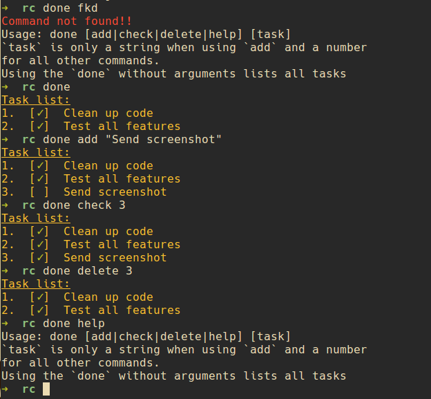

DONE!! [](https://www.codetriage.com/v3rse/done)
---

##Intro



I created this project while I was filling out the form for [RC](www.recurse.com). It's a simple command line TODO list app.

##Installation

```bash
git clone https://github.com/v3rse/done.git <path-to-done>
cd <path-to-done>
npm install
#put this in your bash-profile file
alias done="node <path-to-done>"
```
Where `<path-to-done>` is where you want `done` to live

##Usage

```bash
#add a task
done add "Write an npm module"

#list tasks
done

#check off a task
done check <task-number>

#delete a task
done delete <task-number>
```

## Workflow
* I organise project specific tasks into their corresponding directories. `done` creates a new data file wherever you run it.
* I put my weekly overall tasks in my home directory and run `done` whenever I open a terminal.

### Ignore the `.json` file
A good idea is to add `.database.json` to your `.gitignore` files if you're using this in a git project directory.

## Contribute
Check out the [issues](https://github.com/v3rse/done/issues).

If you don't want to contribute code you could also contribute thought :neckbeard: [here](https://github.com/v3rse/done/issues/2).

Follow the __Installation__ instructions to get the code on your computer.
